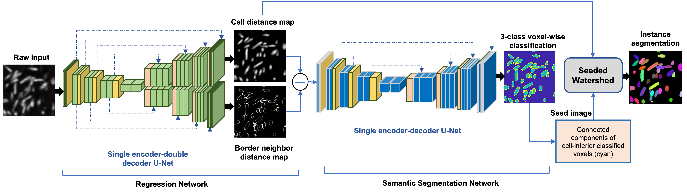

# Accurate Cell Segmentation in Microscopy Imaging
This repository provides the Python implementation of our work on **3D cell segmentation** in microscopy images. We propose a cascaded deep learning architecture [1] consisting of two deep learning networks: an **image regression network** and a **voxel-wise classification network**. First, the double-decoder U-Net-based image regression network estimates two **Euclidean distance maps**, including an enhanced cell-interior map and a border-enhanced map. Next, the difference of these two maps is fed as input to another U-Net-based voxel-wise classification network, which outputs a **semantic segmentation mask**. Finally, an instance-wise mask is provided by utilizing the outputs of the two networks in a classical **seeded watershed** approach.

---

## Installation
### Install environment for 'distance map estimation network':
mamba create -n map_est python=3.8  
conda activate map_est  
mamba install pytorch==1.13.0 torchvision==0.14.0 torchaudio==0.13.0 pytorch-cuda=11.7 -c pytorch -c nvidia  
mamba install -c conda-forge openh264  
mamba install conda-forge::python-graphviz  
pip install -r requirements.txt
---
### Install environment for 'voxel-wise classification network':
conda create --name final_seg python=3.8  
conda activate final_seg  
cd MONAI-0.5.2  
pip install -e ".[all]"  
---

## Training
To train network for segmentation task, input-label pairs are needs.  
input: intensity image (uint8 datatype)  
label: instance image (uint16 datatype)  
input train data needs to placed under the directory: './train_data/01'  
label train data needs to placed under the directory: './train_data/01_ST/SEG'  

### Train distance map estimation network
activate env: conda activate map_est  
step 1: First generate input and ground-truth(distance maps) pairs using the script 'prepare_groundtruth_network_distance_maps.py'  
step 2: Run the training script 'Train_network_distance_maps.py'. The model will be saved in the folder 'Trained_model_distance_maps' as 'distance_model_01.pth'
---
### Train semantic segmentation network
activate env: conda activate final_seg  
step 1: First generate input (difference distance map) and ground-truth(three-class voxl-wise mask) pairs using the script 'prepare_groundtruth_semantic_seg_network.py'  
step 2: Run the training script 'Train_network_semantic_segmentation.py'. The model will be saved in the folder 'Trained_model_semantic_seg' as 'best_metric_model_dicefocal.pth'
---

## Testing
We have provided a test image of a synthetic bacterial biofilm (3D image) and pre-trained models for the two networks. Download pre-trained models from <a href="https://drive.google.com/file/d/1vMreJ3b3GYIKjEA5xucIr6T91DCQRGC2/view?usp=drive_link" target="_blank">here</a> and extract in the current directory.  
(1) activate env: conda activate map_est  
    run the script 'evaluate_distance_map_estimation.py'. If using newly trained model, change the 'path_model' variable in the script. Otherwise, pre-trained model will be used.  
(2) activate env: conda activate final_seg.  
    run the script 'evaluate_semantic_segmentation.py'. If using newly trained model, change the 'path_model' variable in the script. Otherwise, pre-trained model will be used.

## Citation:
[1] <a href="https://www.sciencedirect.com/science/article/abs/pii/S0957417423025964" target="_blank">Toma, T. T., Wang, Y., Gahlmann, A., & Acton, S. T. (2023, October). DeepSeeded: Volumetric segmentation of dense cell populations with a cascade of deep neural networks in bacterial biofilm
applications. Expert Systems with Applications, 122094.</a>
    

